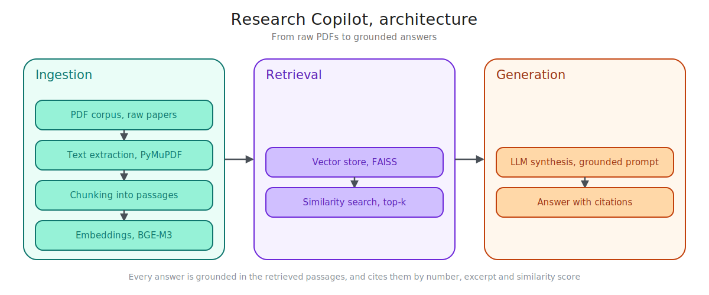

# Research Copilot

A retrieval augmented research assistant that answers questions from a corpus of scientific papers, and backs every answer with real citations you can check.

Ask a question, get a synthesized answer, and see exactly which paper, page, and excerpt it came from — no hallucinated references, no black box.

## How it works



Indexing runs once (or whenever new papers are added): download from arXiv, extract text, split it into overlapping chunks, embed each chunk with BGE-M3, and store the vectors in a FAISS index. Answering a question is much cheaper: only the question itself is embedded, the index is searched for the closest chunks, and an LLM generates an answer strictly from that retrieved context.

## Tech stack

| Layer | Technology | Why |
|---|---|---|
| Paper acquisition | arXiv API | Free, no auth, direct PDF links and metadata |
| PDF parsing | PyMuPDF | Fast, reliable text extraction, page-aware |
| Embeddings | BGE-M3 (self-hosted) | Open weights, strong multilingual retrieval |
| Vector index | FAISS | Full control, runs entirely on local/owned infrastructure |
| Generation | Any OpenAI-compatible endpoint (Ollama locally, vLLM in production) | No vendor lock-in, works identically on a laptop or a GPU server |
| Tooling | uv, ruff, pytest | Fast dependency management, linting, and testing |

## Getting started

```bash
git clone https://github.com/Bamolitho/research-copilot.git
cd research-copilot
uv sync
cp .env.example .env
```

Pull a local model with [Ollama](https://ollama.com) (no GPU required):

```bash
ollama pull qwen3:4b
```

Download some papers, build the index, then ask a question:

```bash
uv run python3 -m ingestion.downloader --query "retrieval augmented generation" --max-results 20
uv run python3 -m scripts.build_index
uv run python3 -m scripts.ask "What are the main challenges of retrieval augmented generation?"
```

See [`scripts/README.md`](./scripts/README.md) for every option, including checkpointing for large corpora.

## Project layout

| Folder | Responsibility |
|---|---|
| [`ingestion/`](./ingestion/README.md) | Downloading papers, PDF parsing, chunking, embeddings |
| [`vector_db/`](./vector_db/README.md) | FAISS storage and similarity search |
| [`llm/`](./llm/README.md) | Prompt construction and answer generation |
| [`scripts/`](./scripts/README.md) | End-to-end CLI pipeline (`build_index`, `ask`) |

Each folder has its own README with full usage details, design notes, and known limitations — start there for anything beyond this overview.

## Testing

```bash
uv run pytest tests/ -v
uv run ruff check .
uv run ruff format .
```

Every module is covered by unit tests that run offline (no real model download or API calls required) except the underlying model calls themselves, which are mocked or dependency-injected.

## Status

The core pipeline works end-to-end from the command line: download, index, and ask, all covered by tests. A web API and a browser UI are not built yet — for now, this is a CLI tool.

## License

MIT, see [LICENSE](./LICENSE).
